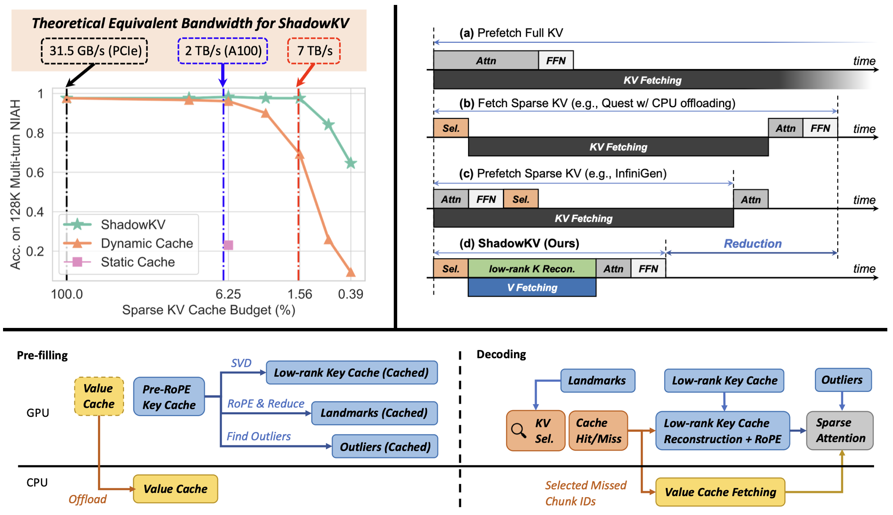
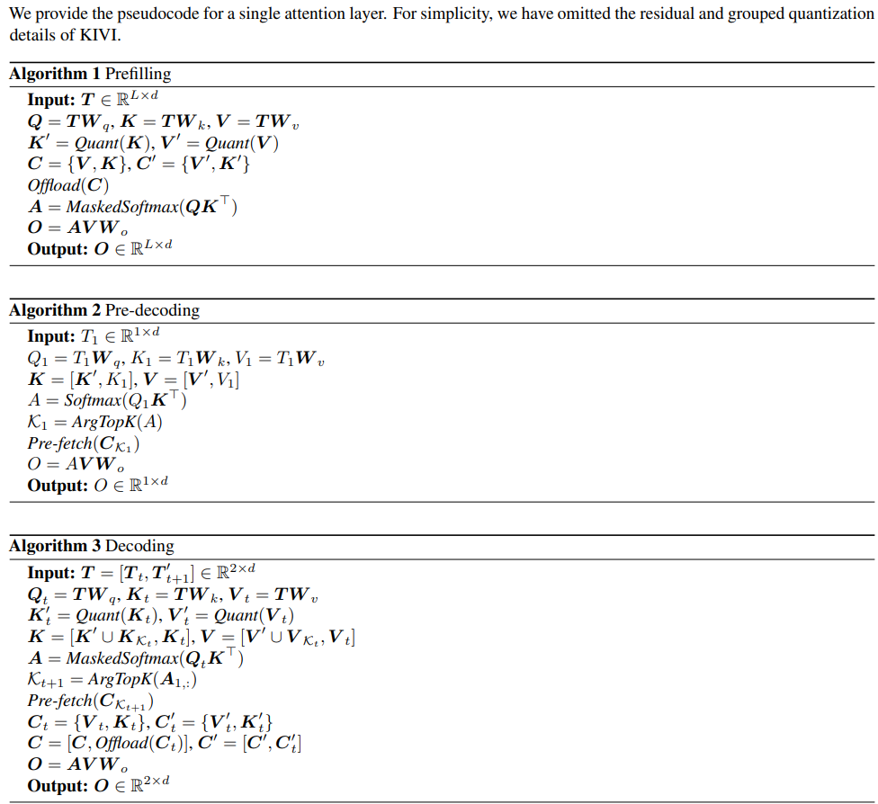
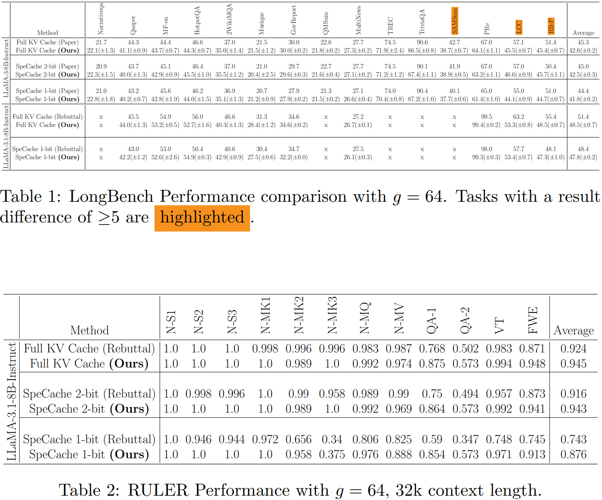

<div align="center">
<h1> ShadowKV & SpeCache</h1>

**training-free, high-throughput long-context LLM inference**
</div>
<div align="center">

</div>
<div align="center">

</div>
<div align="center">

</div>
<br>

<div align="center">

<figcaption>ShadowKV Framework</figcaption>
[<a href="https://arxiv.org/abs/2410.21465">ShadowKV Paper</a>] | [<a href="https://ByteDance-Seed.github.io/ShadowKV">ShadowKV Blog</a>]
</div>
<br>

<div align="center">

<figcaption>SpeCache Algorithm</figcaption>
[<a href="https://openreview.net/pdf?id=PQIrsaIQdn">SpeCache Paper</a>]
</div>

## Updates

- **[2025.10]** SpeCache implementation (beta version) has been added to the ShadowKV repository

## Environment Set Up
To reproduce the results in the paper, you need to set up the environment as follows with a single A100 GPU:
```bash
# create env
conda create -n ShadowKV python=3.10 -y
conda activate ShadowKV

# install packages
pip install -r requirements.txt
pip install flash-attn --no-build-isolation

# nemo dependencies (for dataset building)
pip install wheel
pip install Cython
pip install youtokentome
pip install nemo_toolkit[all]==1.23

# flashinfer
pip install flashinfer -i https://flashinfer.ai/whl/cu121/torch2.3/

# cutlass
mkdir 3rdparty
git clone https://github.com/NVIDIA/cutlass.git 3rdparty/cutlass

# build kernels for ShadowKV
python setup.py build_ext --inplace
```


## Scripts for SpeCache
> **Note** \
> Currently, SpeCache is only compatible with LlamaForCausalLM architecture-based models (Llama-3-8B-Instruct-Gradient-1048k, Llama-3.1-8B-Instruct, Meta-Llama-3-8B-Instruct, etc.)

### SpeCache Configuration
Before you run the command, you can set the SpeCache configuration at `specache/specache_{1/2}bit_config.yaml` :

```bash
# SpeCache configuration
quant_k_bit: 2        # key cache quant. bit width (int)
quant_k_mode: channel # key cache quant. mode ('channel', 'token')

quant_v_bit: 2        # value cache quant. bit width (int)
quant_v_mode: token   # value cache quant. mode ('channel', 'token')

do_specache_quant: false
quant_group_size: 64  # Quantization group size
quant_resuidual: 64   # KIVI Residual length
arg_top_k: 64         # Prefetch top-k 16-bit KV pairs from CPU memory
cpu_mode: false       # Offload 16-bit KV cache to CPU memory or not
```

### Run Evaluations

For the accuracy evaluation, please run the following command:

```bash
# RULER benchmark
bash specache_scripts/run_ruler_eval.sh

# LongBench benchmark
bash specache_scripts/run_longbench_specache_{1/2}bit_eval.sh
```
Comparison between paper/rebuttal results and our implementation results :

<div align="center">

<br>
* Rebuttal result : <a href="https://openreview.net/forum?id=PQIrsaIQdn">https://openreview.net/forum?id=PQIrsaIQdn</a>
<br>
* LongBench results are obtained from running with 5 different random seeds
</div>
<br>

Checking SpeCache hit rate:
```bash
# Hit rate from LongBench
bash specache_scripts/run_longbench_specache_{1/2}bit_hitrate.sh
bash specache_scripts/run_hitrate_analysis.sh
```

### For Debugging

```bash
OMP_NUM_THREADS=48 torchrun --standalone --nnodes=1 --nproc_per_node 1 test/debug_specache.py --datalen 131072 --method specache --dataset_name "ruler/niah_single_2" --model_name "/local_path_to/meta-llama/Llama-3.1-8B-Instruct"
```

## Accuracy Evaluations for ShadowKV
Here we provide an example to build the dataset and run evaluation for the [RULER](https://github.com/hsiehjackson/RULER) benchmark with Llama-3-8B-1M.

### Build Datasets
To build RULER dataset, please run the following command:
```bash
# build RULER
python -c "import nltk; nltk.download('punkt')"
cd data/ruler
bash create_dataset.sh "gradientai/Llama-3-8B-Instruct-Gradient-1048k" "llama-3"
```

### Run Evaluations
For the accuracy evaluation, please run the following command with 8xA100 GPUs:

```bash
# Full attention
OMP_NUM_THREADS=48 torchrun --standalone --nnodes=1 --nproc_per_node 8 test/eval_acc.py --datalen 131072 --method full --dataset_name "ruler/niah_single_1,ruler/niah_single_2,ruler/niah_single_3,ruler/niah_multikey_1,ruler/niah_multikey_2,ruler/niah_multiquery,ruler/niah_multivalue,ruler/vt,ruler/fwe,ruler/qa_1,ruler/qa_2" --model_name "gradientai/Llama-3-8B-Instruct-Gradient-1048k"

# ShadowKV
OMP_NUM_THREADS=48 torchrun --standalone --nnodes=1 --nproc_per_node 8 test/eval_acc.py --datalen 131072 --method shadowkv --dataset_name "ruler/niah_single_1,ruler/niah_single_2,ruler/niah_single_3,ruler/niah_multikey_1,ruler/niah_multikey_2,ruler/niah_multiquery,ruler/niah_multivalue,ruler/vt,ruler/fwe,ruler/qa_1,ruler/qa_2" --sparse_budget 2048 --rank 160 --chunk_size 8
```

#### Compatibility with MInference
ShadowKV is compatible with pre-filling acceleration techniques, such as MInference. To enable MInference, please add the `--minference` flag to the command. For example:

```bash
# Full attention with MInference
OMP_NUM_THREADS=48 torchrun --standalone --nnodes=1 --nproc_per_node 8 test/eval_acc.py --datalen 131072 --method full --dataset_name "ruler/niah_single_1,ruler/niah_single_2,ruler/niah_single_3,ruler/niah_multikey_1,ruler/niah_multikey_2,ruler/niah_multiquery,ruler/niah_multivalue,ruler/vt,ruler/fwe,ruler/qa_1,ruler/qa_2" --minference

# ShadowKV with MInference
OMP_NUM_THREADS=48 torchrun --standalone --nnodes=1 --nproc_per_node 8 test/eval_acc.py --datalen 131072 --method shadowkv --dataset_name "ruler/niah_single_1,ruler/niah_single_2,ruler/niah_single_3,ruler/niah_multikey_1,ruler/niah_multikey_2,ruler/niah_multiquery,ruler/niah_multivalue,ruler/vt,ruler/fwe,ruler/qa_1,ruler/qa_2" --sparse_budget 2048 --rank 160 --chunk_size 8 --minference
```
## Supported Models for ShadowKV
Currently, we support the following LLMs:
- Llama-3-8B-1M: [gradientai/Llama-3-8B-Instruct-Gradient-1048k](https://huggingface.co/gradientai/Llama-3-8B-Instruct-Gradient-1048k)
- GLM-4-9B-1M: [THUDM/glm-4-9b-chat-1m](https://huggingface.co/THUDM/glm-4-9b-chat-1m)
- Llama-3.1-8B: [meta-llama/Meta-Llama-3.1-8B-Instruct](https://huggingface.co/meta-llama/Meta-Llama-3.1-8B-Instruct)
- Yi-9B-200K: [01-ai/Yi-9B-200K](https://huggingface.co/01-ai/Yi-9B-200K)
- Phi-3-Mini-128K: [microsoft/Phi-3-mini-128k-instruct](https://huggingface.co/microsoft/Phi-3-mini-128k-instruct) (only NIAH test supported)
- Qwen2-7B-128K: [Qwen/Qwen2-7B-Instruct](https://huggingface.co/Qwen/Qwen2-7B-Instruct) (only NIAH test supported)

## Efficiency Evaluations for ShadowKV
For the efficiency evaluation, please run the following command with a single A100 GPU:

```bash
python test/e2e.py --model_name "meta-llama/Meta-Llama-3.1-8B-Instruct" --datalen "122k"
```


## Citation
If you find ShadowKV useful or relevant to your project and research, please kindly cite our paper:

```bibtex
@article{sun2024shadowkv,
  title={ShadowKV: KV Cache in Shadows for High-Throughput Long-Context LLM Inference},
  author={Sun, Hanshi and Chang, Li-Wen and Bao, Wenlei and Zheng, Size and Zheng, Ningxin and Liu, Xin and Dong, Harry and Chi, Yuejie and Chen, Beidi},
  journal={arXiv preprint arXiv:2410.21465},
  year={2024}
}
```
